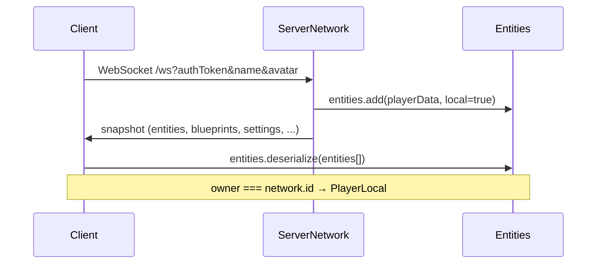
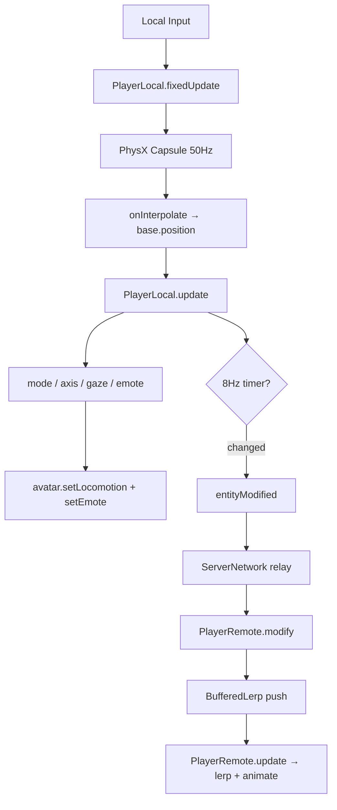

# Character Synchronization

How player state moves between clients and the server in this Hyperfy PvP fork.

---

## Model at a Glance

| Aspect | Model |
|--------|-------|
| Movement (position, rotation) | **Client-authoritative** — owner simulates, server relays |
| Locomotion animation (`m`, `a`, `g`, `e`) | **Client-authoritative** — derived locally, relayed |
| Combat effects (`ef`) | **Client-authoritative** — sent immediately on change |
| Health / damage | **Server-authoritative** — validated on `playerHit` |
| Teleport / push | **Server-routed** to target client |

There is **no movement prediction or server reconciliation**. The owning client is the source of truth for where their character is. Remote clients **interpolate** with a time buffer (~187 ms), not extrapolate.

---

## Entity Types

When a player entity is created, `Entities.add()` picks the class from `data.owner`:

```
data.owner === network.id  →  PlayerLocal   (this machine's player)
data.owner !== network.id  →  PlayerRemote  (everyone else)
```

On the **server**, all players are `PlayerRemote` (server `network.id` is `0`; owner is the user's socket id). The server stores player data but does not run PhysX or render avatars.

**Key files:**
- `src/core/systems/Entities.js` — creation, lifecycle
- `src/core/entities/PlayerLocal.js` — local simulation + network send
- `src/core/entities/PlayerRemote.js` — remote interpolation + animation playback

---

## Scene Graph (Both Player Types)

```
base (group)              ← synced transform (p, q)
├── avatar (VRM node)
├── sword (GLB, hand-attached in lateUpdate)
├── aura (group)
│   ├── nametag (+ health bar)
│   └── chat bubble UI
└── body (remote only: kinematic rigidbody + capsule collider)
```

---

## Connection & Initial State



Server spawn (`ServerNetwork.onConnection`):

- Position from configured spawn point
- Health: 100 (`HEALTH_MAX`)
- Avatar: user avatar → world default → `asset://avatar.vrm`
- Broadcasts `entityAdded` to other clients

After the snapshot, only incremental packets are used.

---

## Ongoing Sync: `entityModified`

The primary sync packet. Fields are abbreviated and **delta-compressed** — only changed fields are sent.

| Field | Meaning |
|-------|---------|
| `id` | Player entity ID |
| `p` | Position `[x, y, z]` |
| `q` | Quaternion `[x, y, z, w]` |
| `m` | Locomotion mode (0=IDLE … 6=TALK) |
| `a` | Movement axis (8-direction blend weights) |
| `g` | Gaze direction vector |
| `e` | Emote URL (non-combat emotes) |
| `ef` | Effect object `{ emote, duration, cancellable, … }` — attacks, blocks, death |
| `t` | Teleport flag — forces instant snap on remote |
| `name`, `health`, `avatar`, `sessionAvatar`, `rank` | Metadata |

### Send path (local player)

`PlayerLocal.update()` accumulates time; every `world.networkRate` (125 ms / 8 Hz):

1. Compare current state to `lastState`
2. Build delta with only changed fields
3. `network.send('entityModified', data)` if anything changed

Combat effects bypass the 8 Hz timer — `setEffect()` sends `ef` immediately.

### Relay path (server)

```js
// ServerNetwork.onEntityModified
entity.modify(data)
this.send('entityModified', data, socket.id)  // broadcast, exclude sender
```

### Receive path (remote client)

```js
// ClientNetwork.onEntityModified
entity.modify(data)
// → PlayerRemote pushes into BufferedLerp*, updates animation
```

---

## Position & Rotation

### Local player

1. PhysX dynamic capsule (`initCapsule`) drives movement in `fixedUpdate()` (50 Hz)
2. `Physics.onInterpolate` copies capsule pose to `base.position` each render frame
3. Body Y-rotation slerps toward camera facing in `update()`
4. Sends `p`, `q` at 8 Hz when changed

### Remote player

1. Kinematic rigidbody + capsule collider (collision only, no simulation)
2. Network updates pushed into buffered lerpers:

```js
this.position = new BufferedLerpVector3(base.position, networkRate * 1.5)   // ~187 ms buffer
this.quaternion = new BufferedLerpQuaternion(base.quaternion, networkRate * 1.5)
```

3. `modify()` calls `position.push(p, teleportToken)` / `quaternion.push(q, teleportToken)`
4. `update()` lerps/slerps each frame from the 3-sample ring buffer
5. Teleport (`t: true`) increments token → all buffer samples reset instantly

**Interpolation class:** `src/core/extras/BufferedLerpVector3.js`, `BufferedLerpQuaternion.js`

Non-player entities (`App.js`) use simpler single-pair `LerpVector3`/`LerpQuaternion`.

---

## Animation Sync

Animation is **not** sent as skeletal data. Clients reconstruct motion from synced state:

| Input | Drives |
|-------|--------|
| `m` (mode) | IDLE, WALK, RUN, JUMP, FALL, FLY, TALK |
| `a` (axis) | 8-direction walk/run blend |
| `g` (gaze) | Head/neck aim |
| `e` | Non-combat emote URL |
| `ef` | Combat/death effects (attack, block, fall, getup) |

Both player types call:

```js
avatar.instance.setLocomotion(mode, axis, gaze)
avatar.instance.setEmote(emote, duration)   // from ef
```

VRM factory (`src/core/extras/createVRMFactory.js`) blends locomotion pose clips and overlays attack/death emotes with higher blend weight.

### Remote combat timing

`PlayerRemote.update()` mirrors attack/block collider timing from synced `ef`:

- Sets `currentBlockTag` / `currentAttackTag` from effect emote URL (blocker tags must be synced for attacker-side tag matching)
- Activates block collider when block emote effect is active
- `duration > 10` → charged attack (pause at 500 ms)
- `duration` drops from >10 to ≤10 → release → activate sword collider
- Normal attack: collider after 500 ms timeout
- `onAttackCanceled()` clears effect and disables collider

---

## Tick Rates

| Layer | Rate | Where |
|-------|------|-------|
| Network sync | **8 Hz** | `World.networkRate = 1/8` |
| Physics | **50 Hz** | `World.fixedDeltaTime = 1/50` |
| Server tick | **30 Hz** | `Server.TICK_RATE` |
| Client render | Display refresh | `requestAnimationFrame` |

Physics runs locally on the client only. The server does not simulate player physics.

---

## Clock Sync

On each `pong` reply:

```
offset = serverTime - localTime - (roundTripTime / 2)
network.getTime() = Date.now() + offset
```

Used for server-synchronized timestamps in buffered interpolation.

---

## Avatar Loading

URL priority in `applyAvatar()`:

1. `sessionAvatar` (temporary session override)
2. `avatar` (persistent user avatar)
3. `asset://avatar.vrm` (world default)

Loaded via `world.loader.load('avatar', url)` → `Avatar` node → `createVRMFactory()`.

Local player calls `disableRateCheck()` for max animation FPS. Remote avatars throttle update rate by camera distance (5–60 Hz).

---

## Other Player Packets

| Packet | Direction | Purpose |
|--------|-----------|---------|
| `playerTeleport` | S→C | Force snap position |
| `playerPush` | C→S→C | Apply impulse force |
| `playerSessionAvatar` | both | Temporary avatar swap |
| `playerHit` | C→S | Combat damage (see [combat.md](combat.md)) |
| `entityRemoved` | S→C | Player disconnect |

Scripting API: `src/core/extras/createPlayerProxy.js` — `damage()`, `heal()`, `teleport()`, `push()`, `applyEffect()`.

---

## End-to-End Flow



---

## Key Source Files

| File | Role |
|------|------|
| `src/core/entities/PlayerLocal.js` | Local sim, network send, combat |
| `src/core/entities/PlayerRemote.js` | Remote interpolation, animation |
| `src/core/systems/ClientNetwork.js` | Client packet handlers |
| `src/core/systems/ServerNetwork.js` | Server relay, spawn, combat validation |
| `src/core/extras/BufferedLerpVector3.js` | Remote position interpolation |
| `src/core/extras/BufferedLerpQuaternion.js` | Remote rotation interpolation |
| `src/core/extras/createVRMFactory.js` | VRM locomotion + emotes |
| `src/core/nodes/Avatar.js` | Avatar scene node |
| `src/core/systems/Physics.js` | Local physics + visual interpolation |
| `src/core/World.js` | Tick loop, `networkRate` |
