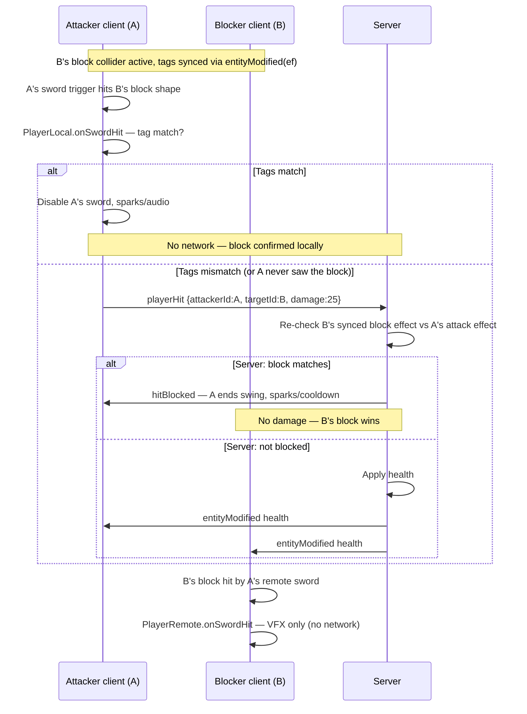

# Combat System

## Overview

Combat is **client-predicted for hits and blocks, server-arbitrated for the final outcome**:

1. Attacker's client detects sword contact locally (PhysX trigger)
2. Block vs damage is first predicted on the attacker's client (tag match) — a locally-confirmed block sends **no packet**
3. On predicted damage: client sends `playerHit` → **server re-checks the defender's synced block state** (`ef` effect) with the same tag-match table
   - Not blocked → server applies health → broadcasts `entityModified`
   - Blocked → server sends `hitBlocked` back to the attacker (no damage); attacker's client ends the swing and shows sparks
4. All clients update health bars / death state from server; VFX (sparks/blood) from local PhysX prediction

This means the server is the single authority when the attacker's and defender's simulations disagree (e.g. the defender raised a block that the attacker's lagged replica hadn't shown yet). The defender's block wins if their block `ef` reached the server before the attacker's `playerHit` — which is nearly always the case, because block effects are sent immediately at block start while the hit packet is only sent at sword contact (≥500 ms later in the swing).

---

## Attack System

### Input → Attack

| Input | Action |
|-------|--------|
| Key 1 | Instant attack left |
| Key 2 | Instant attack right |
| Key 3 | Instant attack high |
| Key 4 | Instant attack low |
| Left mouse drag ≥ 30px (pointer locked) | Charged directional attack — drag starts backswing; release triggers swing (early release waits for windup) |
| Mobile attack joystick (bottom-right) | Same as left mouse drag — touch = mouse down, deflect = drag direction, release = mouse up |

Drag direction picks emote (dominant axis: horizontal vs vertical, sign of dx/dy). Guards: not sprinting, not already charging, not committed mid-swing.

Instant attacks (`startAttack(emote, false)`) skip the hold phase and activate the sword collider at 500 ms.

Emote maps to attack tag:

| Emote | Tag |
|-------|-----|
| `ATTACK_HIGH` | `high` |
| `ATTACK_LEFT` | `left` |
| `ATTACK_RIGHT` | `right` |
| `ATTACK_LOW` | `low` |

### Timing Phases

```
t = 0ms       Mouse drag triggers startAttack()
              Animation plays to backswing and PAUSES (charged mode)
              swordColliderActive = false
              isInWindup = true

              [Player holds mouse button...]

t = release   completeChargedAttack() OR pendingChargedRelease
  ├─ before 500ms windup → finish windup, pause at backswing 500ms, then auto-swing
  └─ after 500ms windup (holding click) → swing immediately on release

t = 500ms     Animation reaches backswing pose
              ├─ still holding click → pause until release (can swing right away)
              └─ released early → pause 500ms, then auto-swing
              hitPlayersThisSwing = new Set()
              
t = 1000ms    Sword collider DEACTIVATES
              Attack over, return to idle
```

### Sword Collider

Defined in `PlayerLocal.initSwordCollider()`:

```
Shape:   Box  0.1w × 1.0h × 0.05d  (blade dimensions)
Type:    TRIGGER_SHAPE (no physics push, only enter/exit callbacks)
Layer:   weapon  →  masks with: player
Initial: DISABLED
```

`setSwordColliderActive(active)`:
- Sets `eTRIGGER_SHAPE` flag on the PhysX shape
- When activating: sets `swordColliderReady = false`, waits 16ms before setting `true` — prevents phantom hits from residual overlap

### `onSwordHit(otherHandle)`

Called on the **attacker's client** when the sword trigger overlaps another collider.

```
1. Guard: collider active? collider ready?
2. If otherHandle.tag === 'block':
   a. Read attacker's currentAttackTag vs blocker's currentBlockTag
   b. Match → disable sword, sparks/audio (no server packet)
   c. Mismatch → fall through — treat blocker as hit target (damage through wrong block)
3. Guard: already hit this player this swing?
4. spawnBloodParticles + playHitAudio
5. network.send('playerHit', { attackerId, targetId, damage: 25, hitPos })
```

Server receives `playerHit` and validates:

1. `attackerId` must be the sender's player; sender must not be a spectator
2. `damage` must be ≤ 25 (melee cap)
3. Sender's synced `ef` must be an attack emote (same-socket ordering guarantees the attack effect always arrives before the hit packet)
4. **Block arbitration**: the target's synced `ef` is checked with the same tag-match table — if the block matches, the server sends `hitBlocked` to the attacker and applies **no damage**
5. Otherwise: applies damage, broadcasts `entityModified`, records `hitPos` for blood remnants

On receiving `hitBlocked`, the attacker's client (`PlayerLocal.onServerHitBlocked`) disables the sword collider, applies the post-block attack cooldown, and plays sparks + block audio at the target — converging with what the defender already saw.

---

## Block System

Block prediction runs on each client, but the **server has the final say**: when an attacker claims damage via `playerHit`, the server re-checks the defender's synced block effect and rejects the hit (`hitBlocked`) if the block matches. A block the attacker confirms locally never touches the server.

Blocking is **directional**: your block pose must match the incoming attack direction. A wrong block does not stop the sword — the attack deals damage as if it passed through the shield.

### Input → Block

| Input | Action |
|-------|--------|
| Key 5 | Generic block (`Emotes.BLOCK`) — `currentBlockTag = null`, blocks **all** directions |
| Right mouse drag ≥ 30px (pointer locked) | Held directional block — animation freezes at block pose until release |
| Mobile block joystick (bottom-right, above attack stick) | Same as right mouse drag — touch = mouse down, deflect = drag direction, release = mouse up |

Mouse drag picks block emote the same way as attacks (dominant axis + sign).

Key 5 uses **normal mode** (1 s timed block). Mouse drag uses **hold mode** (collider stays up until release).

| Block emote | `currentBlockTag` | Blocks attack tag |
|-------------|-------------------|-------------------|
| `BLOCK_HIGH` | `high` | `high` |
| `BLOCK_LOW` | `low` | `low` |
| `BLOCK_LEFT` | `left` | `right` (mirror) |
| `BLOCK_RIGHT` | `right` | `left` (mirror) |
| `BLOCK` (key 5) | `high` | `high` only — shares `blockhigh.glb` with `BLOCK_HIGH`, so every simulation (local, remote, server) resolves it as a high block |

Left/right mirror: you block left to stop a swing coming from your right.

### Starting a block (`startBlock`)

1. Sets `isBlocking = true` and `currentBlockTag` from emote
2. Activates block collider immediately (`setBlockColliderActive(true)`)
3. Sends `entityModified` with `ef` (effect) so remote clients mirror the block animation and tag

**Hold mode** (mouse drag): effect duration 999 s, animation pauses at 500 ms via mixer `timeScale = 0` (local and remote). Released via `stopBlock()` → collider off, tags cleared, `setEffect(null)`.

**Normal mode** (key 5): effect duration 1 s, collider auto-deactivates after `blockDuration`.

### Block collider design

```
Shape:   Box  ~0.9w × ~1.6h × 0.3d  (in front of player at chest height)
Type:    SIMULATION_SHAPE  (not a trigger — sword triggers can detect it)
Layer:   player group, weapon mask
Position: 0.5 m in front of player, 60% of capsule height (lateUpdate)
```

Sword colliders are **triggers**; block colliders are **simulation shapes** because PhysX does not fire trigger–trigger overlaps. The sword trigger detects the block simulation shape.

Remote players get the same block collider (`PlayerRemote.initBlockCollider`) but **no** `onBlockHit` callback — only the attacker-side sword trigger drives block resolution.

### Tag matching algorithm

Used identically in `PlayerLocal.onSwordHit` and `PlayerLocal.onBlockHit`:

```js
// null blockTag (key 5 generic block) → blocks everything
if (!blockTag) blocked = true
else if (blockTag === 'high' && attackTag === 'high') blocked = true
else if (blockTag === 'low'  && attackTag === 'low')  blocked = true
else if (blockTag === 'left' && attackTag === 'right') blocked = true  // mirror
else if (blockTag === 'right'&& attackTag === 'left')  blocked = true  // mirror
else blocked = false  // wrong direction — attack goes through
```

Blocker's `currentBlockTag` on the attacker's machine comes from synced `ef` effect emote (`PlayerRemote.update()` sets tags from emote URL).

### How a block is detected (two clients, one attacker-side decision)

Each client runs its own PhysX scene with all players' colliders. When player A swings at blocking player B:



**Per swing on the attacker, at most one server packet:**

| Outcome | Server packet | When |
|---------|---------------|------|
| Successful block | *(none)* | Tags match — sword disabled locally only |
| Damage | `playerHit` | Wrong block or body hit |

**Primary resolution path:** the **attacker's** `PlayerLocal.onSwordHit` when the sword trigger hits a `block`-tagged collider. Tag matching, sword disable, and whether to send `playerHit` all happen here.

**Blocker-side VFX (no network packet):** On the blocker's client, PhysX runs the same sword-vs-block overlap locally. The callback fires on the **attacker's** `PlayerRemote` entity (`PlayerRemote.onSwordHit`), not on the blocker's `PlayerLocal`. That handler re-runs the same tag match using:

- `this.currentAttackTag` — attack direction synced onto the attacker's remote entity
- `blocker.currentBlockTag` — the local blocker's own tag (from their active block)

| Tag match on blocker's machine | What the blocker sees |
|-------------------------------|------------------------|
| Success | Spark particles + `audioblock.mp3` at chest height |
| Failure | Blood particles + `audiohit.mp3` at chest height |
| Failure (health) | Nametag drops when `entityModified { health }` arrives from server |

The server is **not** in the block path. Blocker VFX comes from local PhysX immediately — same as the attacker.

**Third-party spectators (player C):** C's client also simulates A's remote sword vs B's remote block. The same `PlayerRemote(A).onSwordHit` path runs on C's machine for VFX.

**`PlayerLocal.onBlockHit`:** If this ever fired on the blocker, it would duplicate the same tag logic using `blocker.base` for VFX position. In practice PhysX invokes the sword trigger callback instead; the `PlayerRemote` path is what blockers rely on today.

### Successful block (tags match)

On **attacker's client** (`PlayerLocal.onSwordHit`):

1. Add blocker to `hitPlayersThisSwing` (prevent double-processing)
2. `setSwordColliderActive(false)` — end the swing immediately
3. Spark particles + block audio at blocker's position
4. **No server packet** — blocking is client-authoritative

On **blocker's client** (`PlayerRemote` for the attacker, when its sword hits the local block): same tag match → sparks + block audio, or blood + hit audio on mismatch. No network send.

On **attacker's client**: VFX at blocker's synced position; send `playerHit` to server **only** if tags mismatch (wrong block).

### Failed block (tags mismatch)

The sword is considered to pass through the block collider:

- **Attacker's client:** `onSwordHit` falls through to the normal hit path using the blocker's `playerId` → blood VFX + `playerHit` to server
- **Blocker's client:** `PlayerRemote.onSwordHit` shows blood VFX locally

Wrong block = full 25 damage. There is no partial block or chip damage.

### Directional combat matrix

```
                     ATTACKER
              HIGH  LEFT  RIGHT  LOW
           ┌─────────────────────────
B  HIGH    │  ✓    ✗     ✗      ✗
L  LEFT    │  ✗    ✗     ✓      ✗
O  RIGHT   │  ✗    ✓     ✗      ✗
C  LOW     │  ✗    ✗     ✗      ✓
K
```

Key 5 generic block (`blockTag = null`) matches all columns.

---

## Particle & Audio Feedback

### Blood Particles (hit)

```
Count:     50 particles
Color:     #aa0000 (dark red)
Shape:     small boxes
Velocity:  ±2 m/s horizontal, +1–4 m/s vertical (random)
Lifetime:  0.6 seconds
Gravity:   yes
Emissive:  yes (fades over lifetime)
```

### Blood Splatters (ground)

```
Texture:   asset://bloodsplatter.png
Count:     3–5 per hit
Placement: Raycast down from hit X/Z to ground (not at hit height)
Scale:     0.5–1.2 m, random rotation
Persist:   Session-long decals (cap 200, oldest removed)
```

### Spark Particles (block)

```
Count:     10 particles
Color:     #ffff00 (yellow)
Shape:     small boxes
Velocity:  ±3 m/s horizontal, +2–6 m/s vertical
Lifetime:  0.5 seconds
Emissive:  4.0 intensity (bright flash)
```

### Audio

```
Hit sound:     asset://audiohit.mp3     — volume 0.5, spatial, 20m max
Block sound:   asset://audioblock.mp3   — same settings
Attack grunts: asset://attackgrunt.mp3  — 2s clip; first 1s on backswing, second 1s on swing release (chest height, spatial)
```

### Impact Juice (`src/core/extras/combatJuice.js`)

Layered, client-side feedback on top of the simulation (visual/physics polish only — never changes damage or attack timing):

| Event | Hitstop | Camera kick + zoom | Shake | Extra |
|-------|---------|--------------------|-------|-------|
| Hit landed (attacker) | 70 ms both fighters | directional per attack, punch-IN 0.14–0.19 m | 0.5–0.62 | victim red flash, knockback push, blood spray |
| Kill shot (attacker) | +120 ms both | punch-IN 0.35 m, roll | 1.0 | stacked on hit-landed |
| Attack blocked (attacker) | 50 ms self | backward recoil, punch-OUT 0.12 m | 0.45 | — |
| Block absorbed (defender) | none | backward, punch-OUT 0.08 m | 0.4 | — |
| Took damage (victim) | 85 ms self | down+back jolt, punch-IN 0.15 m | 0.85 | self flash, red screen vignette |

- **Hitstop** — mixer `timeScale = 0.04` (not `0`, so charge-pause detection and effect timers are unaffected), restored via a guard that respects real charge/block pauses.
- **Camera kick** — spring impulse in camera-local space per attack direction: left swing kicks right, right swing kicks left, high chop kicks down, low cut kicks up (±0.065–0.08 m, roll up to ~1.2°).
- **Zoom punch** — spring on `camera.zoom`: punch-in frames a landed hit, punch-out sells rejection (blocked).
- **Camera shake** — trauma-based (`shake = trauma²`), layered-sine noise ≈ 20 Hz, decay ≈ 0.45 s, max amplitude 6 cm. Applied additively after `simpleCamLerp` in `PlayerLocal.lateUpdate`. Skipped in XR.
- **Hit flash** — victim's avatar materials flash red-hot for 90 ms (emissive override). Materials are lazily cloned per avatar instance in `createVRMFactory` so the flash (and test-fighter tint) only affects that one player.
- **Knockback** — attacker sends `playerPush` (2.2 m/s away + small pop up) routed through the server to the victim, so hits physically shove.
- **Damage vignette** — red radial screen flash (`DamageVignette` in `CoreUI.js`) on the victim via `damageFlash` world event; stronger when health ≤ 25.
- **Blood spray** — 150 omnidirectional red chips + 42 directional chips along the swing path per attack tag (`bloodEffects.js`); ground splatter decals unchanged.
- **Spectator view** — remote-vs-remote hits also flash the victim and hitstop both fighters on every client (`PlayerRemote.onSwordHit`).

---

## Damage Values

| Event | Damage |
|-------|--------|
| Sword hit | 25 HP |
| Max health | 100 HP |
| Min health | 0 HP (death) |

Health is clamped server-side: `Math.max(0, Math.min(100, health - damage))`.

---

## Death & Respawn

When health reaches 0:
1. Server broadcasts `entityModified` with `health: 0`
2. `PlayerLocal.onDeath()` — cancels attacks/blocks, sets `isDead = true`
3. `DEATH_FALL` effect (1.5 s) → dead locomotion pose
4. After 5 s: client sends `playerRespawn` with corpse position
5. Server broadcasts `playerCorpse` to other clients, teleports player to team spawn (Crusader/Saracen), restores health to 100 HP
6. Live player gets a fresh avatar at spawn; dead body stays at death location (no networking)

Live corpse spawn (dying client + observers) steals the existing avatar, reparents it while preserving its world transform, and freezes the mixer immediately — typically the fall clip held at its final frame. Joiners/replays load a fresh avatar at the recorded `p`/yaw, step the in-place fall animation to its end under that transform (no dead crossfade), then freeze.

---

## Network Packets (Combat)

Only **`playerHit`** is used for combat damage today. **`attackCanceled`** is sent when an attack is interrupted mid-swing so remote clients stop the animation. Blocking uses local PhysX only.

### `playerHit`  (Client → Server)
```js
{ attackerId: playerId, targetId: playerId, damage: 25, hitPos: [x, y, z] }
```
Server validation: `attackerId` must be the sender's player; damage capped at 25; sender must have an active attack effect; target's synced block effect is re-checked (block arbitration). Applies damage and broadcasts `entityModified`, or replies `hitBlocked`.

Not sent on a locally-confirmed block (tags match on the attacker's client).

### `hitBlocked`  (Server → attacking Client)
```js
{ attackerId, targetId }
```
Server verdict that a claimed hit was actually blocked. The attacker's client ends the swing (sword collider off + post-block cooldown) and plays sparks/block audio at the target.

### `playerRespawn`  (Client → Server)
```js
{ p: [x, y, z], q: [x, y, z, w] }
```
Sent when death timer completes. Server spawns corpse for other clients, teleports player to team spawn, restores health.

### `playerCorpse`  (Server → Clients)
```js
{ playerId, p, q, sessionAvatar }
```
Spawns a static dead avatar at the death location. Not sent back to the respawning client (they spawn it locally).

### `attackCanceled`  (Client → Server → all other Clients)
```js
{ playerId: playerId }
```
Sent when a player's attack is interrupted mid-swing (hit while attacking). Remote clients stop the swing animation immediately (`setEmote(null, undefined, { immediate: true })`) instead of letting the clip play out. Not sent by mouse charged attacks (early release completes the swing instead).

---

## Key Source Files

| File | What's here |
|------|------------|
| `src/core/entities/PlayerLocal.js` | All local player logic: input, physics, attack, block, particles, audio |
| `src/core/entities/PlayerRemote.js` | Remote player: interpolation, animation sync, combat state display |
| `src/core/systems/ServerNetwork.js` | `onPlayerHit`, `onAttackCanceled` — health validation |
| `src/core/systems/ClientNetwork.js` | `onAttackCanceled` receive-side handler |
| `src/core/packets.js` | Packet name constants |
| `src/core/nodes/Collider.js` | PhysX collider node definition (world apps; combat uses inline PhysX actors) |

---

## Related Docs

- [Character synchronization](character-sync.md) — how `ef` effects sync to remote players
- [Server / client networking](server-client.md) — packet reference
- [Documentation index](README.md)

---

## Combat Timing Summary

Attack windup, collider activation, and swing end use **simulation time** (`delta` from the game loop), not wall-clock `setTimeout`. Effect duration for attack emotes does not count down while the mixer is paused (`timeScale = 0` during charge/block hold). The last **0.3 s** of each attack clip (`AttackTiming.recoveryTrim`) is skipped — gameplay, network effect duration, and VRM pose all return to locomotion early so the next attack can start sooner.

```
ATTACK (charged):
─────────────────────────────────────────────────────────────
0ms     Windup — animation plays to backswing
        [hold click to pause at backswing, release to swing]

Early release (before 500ms windup):
  windup completes → pause at backswing 500ms → auto-swing
  (~750ms from attack start minimum)

Hold past windup, release immediately:
  pause at 500ms → swing on release (~750ms+ from release)

+500ms  Sword collider ACTIVE (after 16ms ready delay) on swing
+700ms  Sword off, locomotion restored (0.3s recovery trimmed from clip tail)
─────────────────────────────────────────────────────────────

BLOCK (key 5, normal mode):
─────────────────────────────────────────────────────────────
0ms     Block starts — collider active immediately
1000ms  Collider off, block ends
─────────────────────────────────────────────────────────────

BLOCK (mouse hold mode):
─────────────────────────────────────────────────────────────
0ms     Block starts — collider active immediately
500ms   Animation pauses at block pose
∞       Held until mouse release
        On release: collider off, tags cleared
─────────────────────────────────────────────────────────────
```
