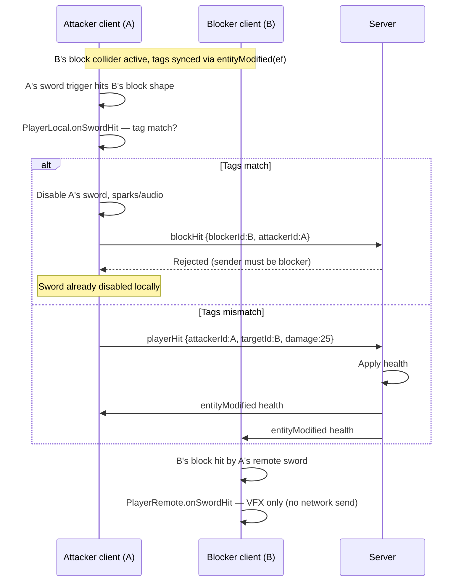

# Combat System

## Overview

Combat is **client-predicted with server validation**:

1. Attacker's client detects the hit locally (physics trigger)
2. Client sends `playerHit` packet to server
3. Server validates the hit is legitimate, applies damage, broadcasts to all
4. All clients update health bars / death state

This means visual feedback (particles, audio) is instant on the attacker's machine; the actual health number comes a round-trip later from the server.

---

## Attack System

### Input → Attack

| Input | Action |
|-------|--------|
| Key 1 | Instant attack left |
| Key 2 | Instant attack right |
| Key 3 | Instant attack high |
| Key 4 | Instant attack low |
| Left mouse drag ≥ 30px (pointer locked) | Charged directional attack — hold backswing, release to swing |

Drag direction picks emote (dominant axis: horizontal vs vertical, sign of dx/dy). Guards: not sprinting, not already charging, not committed mid-swing.

Instant attacks (`startAttack(emote, false)`) skip the hold phase and activate the sword collider at 500 ms.

Emote maps to attack tag:

| Emote | Tag |
|-------|-----|
| `ATTACK_HIGH` | `high` |
| `ATTACK_LEFT` | `left` |
| `ATTACK_RIGHT` | `right` |
| `ATTACK_LOW` | `low` |

### Timing Phases

```
t = 0ms       Mouse drag triggers startAttack()
              Animation plays to backswing and PAUSES (charged mode)
              swordColliderActive = false
              isInWindup = true

              [Player holds mouse button...]

t = release   completeChargedAttack() called
  ├─ held < 500ms → attackCanceled sent, no collider, cancel animation
  └─ held ≥ 500ms → animation resumes, proceed to active phase

t = 500ms     Sword collider ACTIVATES (after 16ms phantom-hit delay)
              hitPlayersThisSwing = new Set()
              
t = 1000ms    Sword collider DEACTIVATES
              Attack over, return to idle
```

### Sword Collider

Defined in `PlayerLocal.initSwordCollider()`:

```
Shape:   Box  0.1w × 1.0h × 0.05d  (blade dimensions)
Type:    TRIGGER_SHAPE (no physics push, only enter/exit callbacks)
Layer:   weapon  →  masks with: player
Initial: DISABLED
```

`setSwordColliderActive(active)`:
- Sets `eTRIGGER_SHAPE` flag on the PhysX shape
- When activating: sets `swordColliderReady = false`, waits 16ms before setting `true` — prevents phantom hits from residual overlap

### `onSwordHit(otherHandle)`

Called on the **attacker's client** when the sword trigger overlaps another collider.

```
1. Guard: collider active? collider ready?
2. If otherHandle.tag === 'block':
   a. Read attacker's currentAttackTag vs blocker's currentBlockTag
   b. Match → disable sword, sparks/audio, send blockHit (see Block System)
   c. Mismatch → fall through — treat blocker as hit target (damage through wrong block)
3. Guard: already hit this player this swing?
4. spawnBloodParticles + playHitAudio
5. network.send('playerHit', { attackerId, targetId, damage: 25 })
```

Server receives `playerHit`, validates, applies damage, broadcasts `entityModified`.

---

## Block System

Blocking is **directional**: your block pose must match the incoming attack direction. A wrong block does not stop the sword — the attack deals damage as if it passed through the shield.

### Input → Block

| Input | Action |
|-------|--------|
| Key 5 | Generic block (`Emotes.BLOCK`) — `currentBlockTag = null`, blocks **all** directions |
| Right mouse drag ≥ 30px (pointer locked) | Held directional block — animation freezes at block pose until release |

Mouse drag picks block emote the same way as attacks (dominant axis + sign).

Key 5 uses **normal mode** (1 s timed block). Mouse drag uses **hold mode** (collider stays up until release).

| Block emote | `currentBlockTag` | Blocks attack tag |
|-------------|-------------------|-------------------|
| `BLOCK_HIGH` | `high` | `high` |
| `BLOCK_LOW` | `low` | `low` |
| `BLOCK_LEFT` | `left` | `right` (mirror) |
| `BLOCK_RIGHT` | `right` | `left` (mirror) |
| `BLOCK` (key 5) | `null` | all directions |

Left/right mirror: you block left to stop a swing coming from your right.

### Starting a block (`startBlock`)

1. Sets `isBlocking = true` and `currentBlockTag` from emote
2. Activates block collider immediately (`setBlockColliderActive(true)`)
3. Sends `entityModified` with `ef` (effect) so remote clients mirror the block animation and tag

**Hold mode** (mouse drag): effect duration 999 s, animation pauses at 500 ms via mixer `timeScale = 0`. Released via `stopBlock()` → collider off, tags cleared, `setEffect(null)`.

**Normal mode** (key 5): effect duration 1 s, collider auto-deactivates after `blockDuration`.

### Block collider design

```
Shape:   Box  ~0.75w × ~1.6h × 0.3d  (in front of player at chest height)
Type:    SIMULATION_SHAPE  (not a trigger — sword triggers can detect it)
Layer:   player group, weapon mask
Position: 0.5 m in front of player, 60% of capsule height (lateUpdate)
```

Sword colliders are **triggers**; block colliders are **simulation shapes** because PhysX does not fire trigger–trigger overlaps. The sword trigger detects the block simulation shape.

Remote players get the same block collider (`PlayerRemote.initBlockCollider`) but **no** `onBlockHit` callback — only the attacker-side sword trigger drives block resolution.

### Tag matching algorithm

Used identically in `PlayerLocal.onSwordHit` and `PlayerLocal.onBlockHit`:

```js
// null blockTag (key 5 generic block) → blocks everything
if (!blockTag) blocked = true
else if (blockTag === 'high' && attackTag === 'high') blocked = true
else if (blockTag === 'low'  && attackTag === 'low')  blocked = true
else if (blockTag === 'left' && attackTag === 'right') blocked = true  // mirror
else if (blockTag === 'right'&& attackTag === 'left')  blocked = true  // mirror
else blocked = false  // wrong direction — attack goes through
```

Blocker's `currentBlockTag` on the attacker's machine comes from synced `ef` effect emote (`PlayerRemote.update()` sets tags from emote URL).

### How a block is detected (two clients, one attacker-side decision)

Each client runs its own PhysX scene with all players' colliders. When player A swings at blocking player B:



**Primary resolution path:** the **attacker's** `PlayerLocal.onSwordHit` when the sword trigger hits a `block`-tagged collider. This is where tag matching, sword disable, damage, and `playerHit` / `blockHit` packets are decided.

**Blocker-side VFX only:** on the blocker's client, the attacker's remote sword hitting the local block runs `PlayerRemote.onSwordHit` — sparks or blood for feedback, but **no** network packets.

**`PlayerLocal.onBlockHit`:** registered on the local block collider but PhysX only invokes callbacks on the **trigger** actor (the sword), not the simulation block shape. In practice block resolution does not run here; the logic mirrors `onSwordHit` for the same tag rules.

### Successful block (tags match)

On **attacker's client** (`PlayerLocal.onSwordHit`):

1. Add blocker to `hitPlayersThisSwing` (prevent double-processing)
2. `setSwordColliderActive(false)` — end the swing immediately
3. Spark particles + block audio at blocker's position
4. Send `blockHit { blockerId, attackerId }` — **server rejects this** because `blockerId` must equal the sender's player id (attacker sent it, not blocker)

On **blocker's client** (`PlayerRemote.onSwordHit`): sparks + block audio only.

The attacker already disabled their sword locally in step 2. The server's `swordBlocked` packet (see below) is intended as a backup via the blocker's `blockHit`, but that path does not fire in current PhysX wiring.

### Failed block (tags mismatch)

The sword is considered to pass through the block collider:

- **Attacker's client:** `onSwordHit` falls through to the normal hit path using the blocker's `playerId` → blood VFX + `playerHit` to server
- **Blocker's client:** `PlayerRemote.onSwordHit` shows blood VFX locally

Wrong block = full 25 damage. There is no partial block or chip damage.

### Directional combat matrix

```
                     ATTACKER
              HIGH  LEFT  RIGHT  LOW
           ┌─────────────────────────
B  HIGH    │  ✓    ✗     ✗      ✗
L  LEFT    │  ✗    ✗     ✓      ✗
O  RIGHT   │  ✗    ✓     ✗      ✗
C  LOW     │  ✗    ✗     ✗      ✓
K
```

Key 5 generic block (`blockTag = null`) matches all columns.

---

## Particle & Audio Feedback

### Blood Particles (hit)

```
Count:     50 particles
Color:     #aa0000 (dark red)
Shape:     small boxes
Velocity:  ±2 m/s horizontal, +1–4 m/s vertical (random)
Lifetime:  0.6 seconds
Gravity:   yes
Emissive:  yes (fades over lifetime)
```

### Spark Particles (block)

```
Count:     10 particles
Color:     #ffff00 (yellow)
Shape:     small boxes
Velocity:  ±3 m/s horizontal, +2–6 m/s vertical
Lifetime:  0.5 seconds
Emissive:  4.0 intensity (bright flash)
```

### Audio

```
Hit sound:   asset://audiohit.mp3   — volume 0.5, spatial, 20m max
Block sound: asset://audioblock.mp3 — same settings
```

---

## Damage Values

| Event | Damage |
|-------|--------|
| Sword hit | 25 HP |
| Max health | 100 HP |
| Min health | 0 HP (death) |

Health is clamped server-side: `Math.max(0, Math.min(100, health - damage))`.

---

## Death & Respawn

When health reaches 0:
1. Server broadcasts `entityModified` with `health: 0`
2. `PlayerLocal.onDeath()` — cancels attacks/blocks, sets `isDead = true`
3. `DEATH_FALL` effect (1.5 s) → dead locomotion pose
4. After 5 s total: `onRespawn()` plays `GETUP` (2 s)
5. On getup complete: `setEffect(null)`, sends `playerHit` with `damage: -100` to self-heal to 100 HP

Position is **not** reset on death — only health and animation state change.

---

## Network Packets (Combat)

### `playerHit`  (Client → Server)
```js
{ attackerId: playerId, targetId: playerId, damage: 25 }
```
Server validation: `attackerId` must be the sender's player. Applies damage, broadcasts `entityModified`.

### `blockHit`  (Client → Server)
```js
{ blockerId: playerId, attackerId: playerId }
```
Server validation: **`blockerId` must be the sender's player** (only the blocker can send this).

On success, server sends `swordBlocked` to the attacker's socket.

In practice, the attacker's `onSwordHit` also sends `blockHit` after a successful block, but the server **rejects** it (wrong sender). The attacker already disabled their sword locally before sending. The `swordBlocked` backup path would require the blocker's `onBlockHit` to fire, but PhysX only invokes trigger callbacks on the sword actor — see Block System.

### `swordBlocked`  (Server → attacker only)
```js
{ blockerId: playerId }
```
Calls `PlayerLocal.onSwordBlocked()` → `setSwordColliderActive(false)`. Belt-and-suspenders disable if the blocker's `blockHit` reached the server.

### `attackCanceled`  (Client → Server → all other Clients)
```js
{ playerId: playerId }
```
Sent when a charged attack is released before the 500 ms threshold. Server validates sender identity, then broadcasts to all other clients. Remote clients clear attack state and disable sword collider.

---

## Key Source Files

| File | What's here |
|------|------------|
| `src/core/entities/PlayerLocal.js` | All local player logic: input, physics, attack, block, particles, audio |
| `src/core/entities/PlayerRemote.js` | Remote player: interpolation, animation sync, combat state display |
| `src/core/systems/ServerNetwork.js` | `onPlayerHit`, `onBlockHit`, `onAttackCanceled` — authoritative validation |
| `src/core/systems/ClientNetwork.js` | `onSwordBlocked`, `onAttackCanceled` receive-side handlers |
| `src/core/packets.js` | Packet name constants |
| `src/core/nodes/Collider.js` | PhysX collider node definition (world apps; combat uses inline PhysX actors) |

---

## Related Docs

- [Character synchronization](character-sync.md) — how `ef` effects sync to remote players
- [Server / client networking](server-client.md) — packet reference
- [Documentation index](README.md)

---

## Combat Timing Summary

```
ATTACK (charged):
─────────────────────────────────────────────────────────────
0ms     Windup — animation pauses at backswing
        [hold mouse...]
<500ms  Release early → attackCanceled, nothing happens
≥500ms  Release → animation resumes
+16ms   Sword collider ACTIVE + ready
+500ms  Sword collider DEACTIVATES
─────────────────────────────────────────────────────────────

BLOCK (key 5, normal mode):
─────────────────────────────────────────────────────────────
0ms     Block starts — collider active immediately
1000ms  Collider off, block ends
─────────────────────────────────────────────────────────────

BLOCK (mouse hold mode):
─────────────────────────────────────────────────────────────
0ms     Block starts — collider active immediately
500ms   Animation pauses at block pose
∞       Held until mouse release
        On release: collider off, tags cleared
─────────────────────────────────────────────────────────────
```
